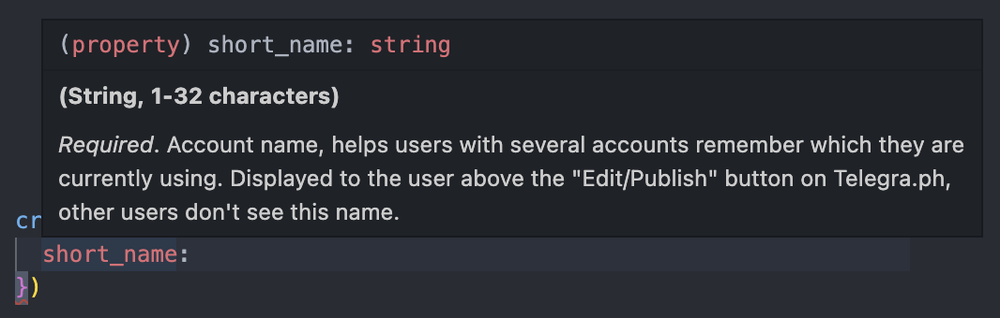

[](https://www.npmjs.com/package/telegraph-wrapper) [](https://github.com/TABmk/telegraph-wrapper/blob/master/LICENSE) 


__Help__ [](https://github.com/TABmk/telegraph-wrapper/issues?q=is%3Aopen+is%3Aissue) [](https://github.com/TABmk/telegraph-wrapper/pulls?q=is%3Aopen+is%3Apr)

#### __Rate me__ [](https://github.com/TABmk/telegraph-wrapper)

# __telegraph-wrapper__

### __[Telegra.ph](https://telegra.ph) [API](https://telegra.ph/api) wrapper__

Official docs - https://telegra.ph/api




## Features
- files upload (local and remote by url)
- all types included
- full docs included
- proxy for upload (TODO)

## Install
`npm i telegraph-wrapper`

  or

`yarn add telegraph-wrapper`

## Usage
### Import
#### CommonJS

`const Telegraph from 'telegraph-wrapper'`

or

`const { createAccount, upload } from 'telegraph-wrapper'`

#### Modules
`import * as Telegraph from 'telegraph-wrapper'`

or

`import { createAccount, upload } from 'telegraph-wrapper'`

### Methods

All methods presented in official docs:

https://telegra.ph/api#Available-methods

Methods returns Promise with api response.

Hover any method and property to preview JSDocs.

Examples:
```
import * as Telegraph from 'telegraph-wrapper';

Telegraph.createAccount({
  short_name: 'acc',
})
  .then(console.log)
  .catch(err => { /* ... */ });

```
```
import { getAccountInfo } from 'telegraph-wrapper';

getAccountInfo({
  access_token: '...',
})
  .then(console.log)
  .catch(err => { /* ... */ });
```
```
import { createAccount } from 'telegraph-wrapper';

try {
  const acc = await createAccount({
    short_name: 'acc',
  });
} catch (err) {
  /* ... */
}
```

### Upload
Allows upload local files and remote (by url) to telegra.ph servers. Returns `Promise<TelegraphOK | TelegraphError>` (see [#Types](#types)).

⚠️ Do not mix local and remote URLs! ⚠️


```
upload([
  './meme.png',
  './meme2.png',
])

or 

upload('./meme.png')
```

### Types

All types also included + upload responses.

Names are the same with [official docs](https://telegra.ph/api#Available-types).

JSDocs included. You can import any type and see docs by hovering it.

#### Upload types

`TelegraphOK` - Telegra.ph success response

`TelegraphOK[].src` - Telegra.ph file link. Example: `/file/123abc123abc123abc123.ext`
```
type TelegraphOK = Array<{
  src: string,
}>;
```

`TelegraphError` - Telegra.ph error response

`TelegraphOK.error` - Error body
```
type TelegraphError = {
  error: string,
};
```